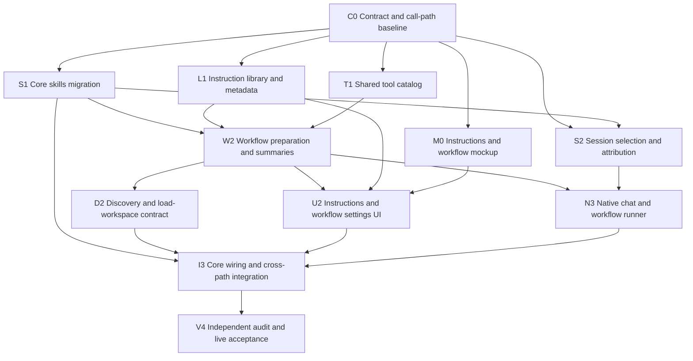

# Instructions Library + Workspace Workflow Preloading — Implementation Plan

**Status:** IN PROGRESS — implementation authorized; contract baseline and visual contract in progress.
**Created:** 2026-10-03.
**Source baseline:** `e54a3ef8`; findings below verified against this checkout.
**Scope of this document:** implementation plan and execution checklist. Proposed fields and flags are not shipped until verified.
**Related plans:** [Skills protocol integration](skills-protocol-integration-plan.md), [Workspace tab redesign](workspace-tab-redesign-plan.md), [Session sticky context](session-sticky-context-plan.md), [Nexus playbooks](nexus-playbooks-skill-plan.md).

## 1. Goal

Let a user select a workspace together with the workflow appropriate to the work
they are about to do. Loading that workflow supplies its instructions and tool
schemas without starting execution.

This is a domain-independent workspace capability. Each workspace exposes its
user-defined workflows; each workflow can attach an optional prompt, any number
of skills, and tools from any available agent. Names, categories, instructions,
resources, and dependencies are data, not domain-specific behavior.

Give prompts and skills one management surface, **Instructions**, with type,
category, and source filters. Prompts remain single blocks of instruction text.
Skills remain packages with a `SKILL.md` entry point and optional supporting
files. A skill containing only `SKILL.md` is valid.

### End-to-end example

1. `getTools` lists a workspace and its available workflows, with exact loading commands.
2. The caller explicitly loads that workspace with Workflow A.
3. Nexus returns workspace context, the selected workflow's steps and optional
   prompt, skill entry-point instructions, resource locations, and required tool schemas.
4. The caller works in the current conversation. Loading itself sends no kickoff
   message and starts no model run.
5. The caller explicitly loads the same workspace with Workflow B to switch setups.
6. A later plain workspace load clears the workflow selection and loads workspace
   context alone.

### Generic scope

| Example domain | Possible workflows | Illustrative instructions/tools |
|---|---|---|
| Research | Source review, Synthesis | Reading, search, evidence review, report drafting |
| Operations | Intake, Reporting | Classification, note updates, task management |
| Software | Investigation, Review | Repository procedures, analysis, available development integrations |
| Creative work | Outlining, Asset preparation | Writing procedures, reference material, available media tools |

These examples illustrate configuration only. There are no built-in workflow
names, fiction/image-specific branches, prescribed categories, or required
providers. The implementation must work with arbitrary user-created names and
the live capability registry.

A workflow may have no prompt, no skills, or no extra tools. A skill may contain
only its entry point or a package of reference files, templates, examples, and
other resources. A prompt or skill can contain instructions for any domain;
neither type implies a writing role, a particular procedure, or execution policy.

### Locked product decisions

| Decision | Resolution |
|---|---|
| Unifying concept | Instructions; one Instruction library in settings |
| Initial types | Prompt and Skill; future types require an adapter and loader |
| Meaning of type | Structure/packaging, not persona versus procedure |
| Prompt storage | Preserve existing custom-prompt storage and IDs |
| Skill storage | Preserve folder packages and the existing provider mirror/sync model |
| Skill ownership | Core Nexus functionality; no install/enable requirement through Apps |
| Workflow ownership | Keep definitions in `workspace.context.workflows` |
| Loading surface | Extend `memory load-workspace` with optional `--workflow <name>` |
| Default workflow | None. Do not add, infer, or remember a default for a workspace |
| Separate load-workflow command | None |
| Execution | Preserve `memory run`; manual and scheduled runs prepare, then execute |
| Conversion | No bulk conversion, type-changing dropdown, or dedicated conversion feature |
| AI-created replacement | Read prompt → create skill → update requested attachments → archive prompt after success |

### Non-goals

- Replacing all prompts with `SKILL.md`, or merging their content stores.
- New MCP meta-tools: the public surface remains `getTools` and `useTools`.
- Introducing a separate skill-set/profile entity alongside workflows.
- Inferring a workflow from a goal, task description, recency, or workspace name.
- Automatically reading every resource or executing scripts from a skill folder.
- Automatically enabling an app or granting tool capabilities because a skill names a tool.
- Rewriting existing prompt bodies, inventing tool dependencies, or changing existing
  prompt execution semantics.
- Building support for hypothetical instruction types beyond the extension points.

## 2. Ground Truth From Code

| Existing component | Current behavior | Implication |
|---|---|---|
| `src/types/mcp/CustomPromptTypes.ts` | Prompt has `id`, `name`, `description`, `prompt`, `isEnabled` | A shared library can project it without content migration |
| `CustomPromptStorageService.ts` | SQLite reads with settings fallback; mutations also save `customPrompts` in plugin settings | Preserve IDs, enabled state, and existing consumers |
| `src/agents/apps/skills/` | Optional app with folder scanning, loading, editing, archiving, and provider sync | Migrate agent, services, and lifecycle into core; retain content and public command identities |
| `SkillScanner.ts` | Identity comes from provider + folder name, not frontmatter name | Keep exact qualified references; handle rename deliberately |
| `SkillIndexService.ts` | Content metadata is derived; archive state and load recency are owned by SQLite | Archive availability must become durable before relying on it across rebuilds |
| `skillFrontmatter.ts`, `SkillWriteService.ts` | Parse/compose currently retain name, description, and body | Editing currently cannot preserve arbitrary dependency metadata |
| `LoadSkillTool` | Returns entry-point instructions, folder listing, history, and updates attribution | Extract reusable content loading from tool/session side effects |
| `WorkspaceWorkflow` | ID, name, when, steps, optional prompt binding and schedule | Add skill references and tool selectors here |
| `LoadWorkspaceTool` | Builds a briefing and returns formatted workflows plus full `workflowDefinitions` | Preserve compatibility, but distinguish available workflow definitions from selected instructions |
| `WorkflowRunService.start` | Creates a new conversation and sends a kickoff message | Preparation must be reusable without invoking `start` |
| `GetToolsTool` | Live workspace names, compact broad tool discovery, full specific schemas | Add bounded workflow summaries; avoid dumping skill bodies into discovery |
| `WorkspaceIntegrationService.loadWorkspace` | Calls the tool with legacy `id`, while the tool reads `workspace`, then can silently fall back | Repair this mismatch and remove silent fallback for explicit workflow preparation |
| `ToolBatchExecutionService` | Binds sessions after successful workspace loading | Consolidate activation so direct/native callers receive the same behavior |
| `SessionContextManager` | Separate active-skill map is attribution-only; workspace bookkeeping can be overwritten by traces | Workflow selection needs its own deliberate state, not the trace context |
| `SettingsView`, `PromptsTab`, `AppsTab` | Prompts have a tab; skill management is nested in app settings | Replace management navigation with one library; move skill source/sync controls there too |
| `cli/playbooks.ts`, `cli/nexus-cli.ts` | Playbooks declare tool selectors and return resolved schemas with the recipe | Reuse the same selector/catalog behavior for workflow dependencies |

Readiness is part of the contract. Workspace discovery already has live lookup and
startup timeout handling. Skills currently require a ready storage runtime. A cold
cache must produce an explicit initializing/unavailable state, not an authoritative
empty library or an inferred workflow.

## 3. Data Model

### 3.1 Shared library projection

Use a type-aware reference. Display names are not identity, and a cache-generated
skill UUID is not a durable cross-rebuild reference.

```typescript
type InstructionReference =
  | { type: 'prompt'; id: string }
  | { type: 'skill'; provider: string; name: string };

interface InstructionSummary {
  reference: InstructionReference;
  type: string;
  name: string;
  description: string;
  categories: string[];
  source: string;
  availability: 'available' | 'archived' | 'unavailable';
}

interface PreparedInstruction {
  reference: InstructionReference;
  name: string;
  instructions: string;
  entrypointPath?: string;
  resourceRoot?: string;
  resources?: string[];
  toolSelectors: string[];
  contentHash: string;
}
```

The initial writable references are the discriminated prompt/skill union above.
The summary's extensible type identifier is resolved through registered adapters.
Unknown types can be displayed as unavailable, but cannot be loaded with guessed
semantics. A new type must provide its reference validation, persistence adapter,
editor, and preparation handler.

**Type and category are separate.** Type identifies Prompt or Skill. Categories
are user-defined labels; an item can have several. No domain taxonomy is required.
Source identifies a native prompt, a Nexus skill, or a provider-sourced skill.

### 3.2 Workflow additions

```typescript
interface SkillReference {
  provider: string;
  name: string;
}

interface WorkspaceWorkflow {
  id: string;
  name: string;
  when: string;
  steps: string;
  promptId?: string;
  promptName?: string;
  schedule?: WorkflowSchedule;
  skills?: SkillReference[];
  tools?: string[];
}
```

Keep the existing optional primary prompt binding and add supporting skills.
This allows one existing bound prompt and several packaged instructions
without rewriting current workflow references. The library is shared even though
the workflow fields remain explicit.

Absent `skills` and `tools` mean empty lists. Extend create/update workspace
schemas, structured load results, and normalizers together. Validate arrays,
qualified names, deduplication, and selector syntax in runtime code: tool schemas
are documentation, not enforcement.

New optional workflow fields round-trip through existing context JSON and workspace
events. Audit both adapter-backed and legacy workspace paths. No workspace column
or content-store migration is required for these fields.

### 3.3 Tool dependencies

Skill entry points may declare Nexus selectors:

```yaml
---
name: source-review
description: Review source notes and record supported findings.
metadata:
  nexus:
    tools:
      - content read
      - search content
      - content write
---
```

Dependencies are command selectors, never executable command strings. They may
name a specific tool or an agent; agent selectors expand to the tools currently
available under that agent. Reject flags and execution payloads here.

Skill dependencies plus workflow `tools` resolve to a union of full CLI schemas,
deduplicated by canonical agent/tool identity. Do not deduplicate by display name,
alias spelling, or description. Prompts may remain dependency-free; a workflow's
extra tools can supply dependencies for an existing prompt without changing it.

Preserve unknown frontmatter keys through edits. Update the parser, composer,
create/update tools, editor, scanner integration, and sync tests. An edit to a
description must not erase `metadata.nexus.tools` or provider metadata.

## 4. Persistence and Identity

### 4.1 Preserve content authorities

- Prompt bodies and prompt enabled state remain in the existing custom-prompt
  settings/storage path.
- Skill bodies and resources remain files under the settings-resolved skills root.
- Workflow definitions remain workspace context, persisted through workspace events.
- Tool schemas and prepared bundles are derived from those authorities and the live
  registry. They are not a new independently editable content store.

### 4.2 Library organization and availability

Introduce a versioned `instructionLibrary` settings section for user organization:
category overrides and skill archive/restore preferences keyed by a canonical,
type-aware reference. Use a collision-safe structured key encoder, not concatenated
display labels or an unchecked object property.

```typescript
interface InstructionLibraryItemSettings {
  categories?: string[];
  archived?: boolean; // skills only; prompts retain their existing isEnabled authority
}

interface InstructionLibrarySettings {
  version: 1;
  items: Record<string, InstructionLibraryItemSettings>;
  skillArchiveImportComplete?: boolean;
}
```

This is user configuration, stored through the normal awaited settings save path,
like current prompt availability. It does not create another prompt/skill body store
or a fourth JSONL stream. Its cross-device behavior is the same as other plugin
settings; copying a skill folder alone does not copy the user's category/archive
preferences. Document this boundary rather than claiming full folder portability.

Route mutations through one live library-metadata service. Normalize the nested
settings explicitly on load: `Settings.applyLoadedData` shallow-merges settings,
and an absent/malformed nested section must not become a writable unchecked object.
Do not create separate Settings instances in the library adapters.

Category overrides take precedence over any declared categories read from skill
metadata; an explicit empty override means uncategorized. Without an override,
use valid imported categories if present, otherwise an empty list. The override is
user organization and is not synced back into a provider's `SKILL.md`.

For skills, persisted settings become archive authority. The index's archive column
is a projection for queries, refreshed from that authority after scan/rebuild.
Every list/load/archive path must use the effective state; leaving one tool reading
only the cached flag would permit archived instructions to load after a rebuild.

Seed legacy archived skill rows into settings once, after storage query readiness
and before a rebuild can discard the only surviving legacy flags.
An existing override wins. Do not mark import complete on timeout or failed save,
and do not interpret a cold empty index as a completed import. If an archive flag
was already lost in an earlier rebuild, it cannot be reconstructed; do not invent it.

Keep load recency as derived/best-effort history. Resetting cached recency may change
sort order, but must never choose a workflow or decide whether a skill is available.

Retain overrides for temporarily missing/deleted skill folders. A later provider
reimport of the same qualified identity must not resurrect an archived skill.
Explicit rename transfers its settings key; scanner pruning must not prune these
user preferences or push them into the provider source.

Persist before reporting success; failed saves leave the UI/session's previous
effective state intact. External settings reloads invalidate the library projection.
Concurrent whole-settings edits retain the repository's existing limitations; avoid
introducing independent writers that overwrite unrelated settings.

### 4.3 References and rename

Prompt IDs remain unchanged. Skill references remain qualified provider/name pairs.
Skill rename needs reference-aware handling: locate affected workflow attachments
and library preferences, update them after successful rename, and report partial
reference-update failures with old/new identities. Retry must be safe.

Do not silently redirect to another similarly named skill. External folder renames
may leave a missing reference; show it in the workflow editor and load error.
Permanent deletion remains UI-only.

## 5. Service Architecture

```text
InstructionLibraryService
  ├── PromptInstructionAdapter → CustomPromptStorageService
  ├── SkillInstructionAdapter  → skill files, scanner/index, library settings
  └── registered future adapters

WorkspaceSummaryService → getTools / list / search / chat picker

WorkspaceLoadService
  ├── passive workspace briefing reader
  ├── WorkflowPreparationService
  │     ├── InstructionLibraryService
  │     └── ToolCatalogService → live registry + ToolCliNormalizer
  └── SessionWorkflowService → deliberate activation/clear after successful preparation

WorkflowRunService
  └── same preparation → new run conversation → kickoff/execution
```

### 5.1 Instruction library and skill loading

Add a shared asynchronous facade for list, read, create, update, archive, restore,
and resource navigation, dispatching by reference type. Native prompt and skill
tools continue to work through their adapters. The UI must not call tools to
perform ordinary library reads.

Extract a `SkillLoadingService` from `LoadSkillTool`. Separate reading/validation
from load-recency stamping, usage-history fetching, and active-skill attribution.
Preparation scans once per operation rather than once per skill; reuse refreshed
index data for the requested references. Never use recency to resolve a qualified
workflow attachment.

Inject narrow interfaces. Core memory/workflow code should not reach through
`SkillsAgent` or instantiate app agents to read files. Both prompt and skill
adapters use core services. Skills have no app install/enable gate; a storage or
file-read failure is an explicit runtime state, not an instruction to enable an app.

### 5.1a Promote the Skills app into core

Move skill agent/tools to `src/agents/skills/` and shared content/index/sync services
to `src/services/skills/` where appropriate. Preserve the existing agent name,
tool slugs, command aliases, input semantics, and file identities. The agent extends
`BaseAgent`, with injected core collaborators; it no longer inherits credentials,
manifest, or runtime access from `BaseAppAgent`.

Register the core skills agent through `AgentInitializationService` /
`AgentRegistrationService` before ToolManager is built, regardless of legacy app
installation or enabled state. Wire settings, App/Vault, storage readiness, and
session attribution through core service interfaces. Do not duplicate the old
`AppRuntimeContext` under a new name.

Remove the skills factory/import from `AppManager`, its installable Apps entry,
and the skills-specific configuration section from `AppsTab`. Exclude migrated
legacy config entries from the app loader so they cannot instantiate a second agent,
replace registry entries, create duplicate watchers, or unregister the core agent.
Other optional apps and their capability gates remain unchanged.

Transfer watcher ownership to the plugin/core service lifecycle. Start after layout
readiness with bounded storage catch-up; unload cancels timers and pending work,
unregisters events, and prevents callbacks from using a closed cache. Keep one
watcher instance across repeated initialization, reload, and storage reconfiguration.
Core registration must not wait for a full scan or delay nonblocking plugin startup.

Migrate the old `apps.apps.skills` configuration once through an awaited,
idempotent settings migration. Keep an original-config snapshot until the migration
is durable. Preserve files, origin paths, archive state, resource snapshots, and
user-defined metadata; there is no skill content move or deletion.

Separate availability of core skills from provider synchronization preferences:

- Previously enabled Skills app: preserve its existing automatic provider import
  and edit sync-back behavior in core settings.
- Previously disabled/not installed: core skill tools and existing vault-native
  files become available, but migration does not start new automatic provider
  imports or sync-back writes.
- Explicit core sync/import operations remain available; expose automatic import
  and edit sync-back preferences in Instructions source/sync controls.
- New installs start without automatic provider import/sync-back unless the user
  enables those preferences. Indexing native skill files remains core functionality.

The current watcher combines provider import and mirror index refresh. Split those
responsibilities so disabling automatic import does not disable native indexing.
Likewise route sync-back-on-edit through its explicit preference. Manual sync
retains a documented, user-requested import/sync-back path.

Failing to persist migration must not report it complete or enable source writes
from unsaved preferences. Retry without creating agents/watchers twice. Remove
legacy app controls only after the core path and preference migration are covered.

### 5.2 Shared tool catalog

Extract schema resolution used by `GetToolsTool` into `ToolCatalogService`.
Reuse `ToolCliNormalizer` for aliases and CLI schema formatting. It accepts the
live registered agents, expands selectors, returns canonical full schemas, and
reports missing or unavailable dependencies.

Both `getTools` and workflow preparation call this service. Do not invoke public
`getTools` internally: that would introduce extra discovery bookkeeping and
workspace lookups into preparation.

Preloading makes tool signatures available in context. It does not register more
provider tools, execute them, override execution policy, or grant permissions.
The two-tool interface and existing execution checks remain authoritative.
Guidance must recognize schemas returned by a successful preload as the same
catalog information supplied by specific discovery, rather than demanding another
identical schema fetch. Initial discovery still exposes the loading command.

### 5.3 Workflow preparation

```typescript
interface PreparedWorkflow {
  id: string;
  name: string;
  when: string;
  steps: string;
  prompt?: PreparedInstruction;
  skills: PreparedInstruction[];
  preloadedTools: CliToolSchema[];
  revision: string; // derived from selected definitions/content/tool signatures
}
```

`prepare(workspace, workflowIdentifier)` resolves and validates the entire bundle
without changing session bindings or starting execution. Use ID-first lookup, then
case-insensitive whole-name matching within the resolved workspace. Multiple name
matches are an error; no fuzzy workflow selection.

Missing/disabled prompt, missing/archived skill, unavailable required tool/app, unreadable entry
point, malformed dependency metadata, or unavailable required tool fails explicit
preparation with the affected reference and an actionable remedy. No silently
omitted dependencies. Supporting resources are listed, not all read.

Existing scheduled/manual workflows with no skill/tool additions keep their old
behavior. For an existing broken prompt binding, replace the runner's silent
fallback with a reported configuration failure, and call out this intentional
tightening in release notes.

### 5.4 Workspace loading and session activation

The public tool receives `workflow?: string`, rendered as `--workflow`.
It resolves workspace context and prepares the requested workflow before applying
the new selection. Treat blank workflow values as invalid rather than silently
interpreting them as an omitted flag.

Use a shared activation path for CLI/MCP batch calls and native/direct calls.
It receives the canonical session UUID from execution context. Remove or delegate
the duplicate successful-load binding in `ToolBatchExecutionService`; review
`ToolExecutionStrategy`, `DirectToolExecutor`, and `AgentExecutionManager` so
the target load remains the deliberate bind and failures cannot switch it.
Success-gate `AgentExecutionManager.updateSessionContext` and any comparable
direct-result hook; today that path can accept context without a success guard.
Failed preparation must not return a binding-bearing `workspaceContext`.

Preserve friendly-handle partition rules. The tool's actual loaded workspace wins
over a different workspace in the execution envelope after a successful load.
Do not treat an outer batch response as proof that its individual load succeeded.
Trace capture may still record the attempted workspace, but must not change the
deliberate workspace/workflow selection.

Commit workspace and workflow selection together after preparation succeeds.
Serialize changes per session and use an operation generation so a slow Workflow A
load cannot overwrite a newer Workflow B load. A failed preparation
keeps the previous selection; a successful plain load clears it.

Passive internal refresh is a separate read operation. Chat prompt assembly,
`#` workspace references, background reads, and discovery must never route through
the public activation operation just to obtain context.

## 6. Public Contract and Discovery

### 6.1 Loading

Proposed tool strings; `--workflow` becomes valid only after the schema change:

```text
memory load-workspace --workspace "Example workspace"
memory load-workspace --workspace "Example workspace" --workflow "Workflow A"
memory load-workspace --workspace "Example workspace" --workflow "Workflow B"
```

Existing context fields remain at the top level of the MCP envelope. CLI context
flags remain before `--`. Do not add a top-level workflow context field, nested
context object, or separate command.

| Operation | Result |
|---|---|
| Plain explicit load | Workspace context + available workflow summaries; no selected workflow |
| Load with workflow | Context + selected instructions/resources + full preloaded tool schemas |
| Another workflow load | Replace this session's selected workflow, including on the same workspace |
| Invalid selection/dependency | Failure with choices/details; previous active selection remains |
| Discovery/list/search | Metadata only; no activation or execution |
| Internal refresh | Rehydrate a deliberate selection without changing it |
| New conversation/session | No selected workflow |
| Resume same conversation/session | Restore the previously explicit selection |
| Manual/scheduled run | Prepare its named workflow, then execute in the run conversation |

Keep existing briefing fields where needed for compatibility. Add
`availableWorkflows`, `loadedWorkflow` (explicit null for a plain load), and
`preloadedTools`. Full `workflowDefinitions` may remain for editing/legacy consumers,
but are data, not active instructions.

The public serializer emits schema bodies once: `loadedWorkflow` omits the internal
bundle's `preloadedTools`, which appears at the response's top level under `data`.
Likewise choose one authoritative prompt-body location in the response and use a
reference in the other field; do not copy the same body into both legacy `prompt`
and `loadedWorkflow.prompt`. Preserve existing prompt-only consumers with an
explicit adapter, and update the response schema alongside serialization.

Native prompt composition must not stringify all workflow steps and bindings into
active instruction sections. Show unselected workflows as choices; inject only
the selected workflow's executable instructions.

### 6.2 Workspace discovery

Preserve `getTools.data.workspaces` as the current name array. Add
`workspaceDetails` with IDs, descriptions, and nested workflow summaries:

```typescript
interface WorkflowSummary {
  id: string;
  name: string;
  when: string;
  promptName?: string;
  skills: SkillReference[];
  loadCommand: string;
}

interface WorkspaceDiscoverySummary {
  id: string;
  name: string;
  description?: string;
  workflows: WorkflowSummary[];
  workflowCount: number;
  workflowsTruncated: boolean;
}
```

Use one `WorkspaceSummaryService` for `getTools`, `memory list-workspaces`,
`memory search-workspaces` matches, and the native workspace picker. Extend the
live provider wired in `AgentInitializationService`; a richer interface on
`GetToolsTool` alone would still return empty workflow lists.

Build summaries from workspace context metadata, not from fully loaded sessions,
states, key-file bodies, or scanning every attached skill. Preserve existing
workspace bounds; add bounded workflow/skill-reference summaries and explicit
truncation metadata. Choose measured limits in implementation and expose a
specific workspace load as the way to inspect its full available list.

Keep discovery passive and startup-safe. Refresh summaries on workspace changes,
archive/rename, and external sync; retain the current bounded startup lookup.
Unavailable discovery must not assert that no workspaces or workflows exist.
The current snapshot-healing comparison checks workspace names only. Replace that
comparison/invalidation for detailed summaries: adding or editing a workflow under
an unchanged workspace name must update both the returned details and later
discovery descriptions. An unqualified array return cannot distinguish an empty
vault from a timeout; the live provider needs an explicit readiness/status result.

Generate quoted loading commands through a shared CLI-literal formatter. Test
quotes, commas, apostrophes, newlines, and shell metacharacters; do not concatenate
an arbitrary workspace/workflow name into executable text.

No new workflow selector grammar is needed in `getTools` for this version.
Nested summaries provide exact choices; the existing specific selector
`memory load-workspace` exposes the added argument.

## 7. Chat Context, Attribution, and Execution

### 7.1 Deliberate selection state

Add `SessionWorkflowService` with a separate session-keyed selection record:

```typescript
interface WorkflowSelection {
  workspaceId: string;
  workflowId: string;
  revision: string;
}
```

Persist this as deliberate session bookkeeping through the existing
session-bindings store, adding an additive/versioned shape for selection records,
keyed by canonical session UUID. Clear on explicit plain
load, session deletion, and successful workspace switch without a workflow.
Never derive it from tool traces or from a workspace's last-used workflow.

For native chat, preserve the selection in conversation metadata or an explicit
reference to its stored session selection; audit conversation conversion/update
paths so plain-load clearing cannot resurrect historical `workflowId`.
Keep workflow-run provenance (`workflowId`, `runTrigger`, `runKey`) separate from
the current active selection: switching setup must not rewrite which run created
the conversation.

Restore is allowed only for the same explicitly selected session/conversation.
It is not a workspace default. Re-resolve content on restore; if an attachment is
now broken, report the unavailable selection and block its use rather than silently
substituting a different workflow. An explicit plain load exits that state.

### 7.2 Prompt composition

Build a dedicated selected-workflow section from prepared state. Include the
bound prompt, workflow steps, skill entry-point bodies, and preloaded tool metadata
once. Preserve base Nexus instructions and workspace-wide preferences.

When a workflow has a primary prompt, it takes precedence over the workspace's
dedicated prompt for this setup; do not inject both as competing primary prompts.
An independently selected chat prompt needs an explicit source distinction:
loading a workflow with a bound prompt temporarily supplies that primary prompt;
clearing it returns to the prior explicit chat prompt, then workspace prompt
fallback. Display the effective source. These are context choices, not mutations
to saved prompt bindings.

Instruction ordering is deterministic, but order is not a conflict resolver.
Conflicting instructions should be surfaced by the model; do not claim that
packaging/type establishes a new permission or trust hierarchy.

Update `ModelAgentWorkspaceContextService`, `ModelAgentPromptContextAssembler`,
`SystemPromptBuilder`, and compaction/restoration paths together. Recompute on an
activation event so a cached `loadedWorkspaceData` does not keep old instructions.
For native chat and workflow runs, budget/account for entry-point bodies and schema
tokens against the known model/context budget before activation. If the bundle
does not fit, fail with actionable size information; do not silently truncate
instructions or fetch every resource.

External MCP/CLI clients do not expose their remaining model context. Return
estimated bundle size and enforce a documented server response-size ceiling;
do not claim to verify fit against an unknown external model budget.

External MCP/CLI clients receive the prepared bundle and an explicit activation/
clear report. Nexus cannot erase old instructions from their conversation history;
return which workflow supersedes the prior one and which managed skills are active.
Restored server selection does not prove an external model has reread the bodies.

### 7.3 Skill attribution

Track workflow-managed skills separately from individually loaded skills.
Effective trace attribution is their deduplicated union. Replacing/clearing a
workflow removes only its contribution. Failed loads stamp no successful skill
activation/recency. Pure discovery and passive context refresh do not count as usage.

The existing active-skill map is attribution-only; extending it must not make
trace updates the authority for workflow selection.

### 7.4 Runs

`WorkflowRunService.start` calls the same preparation service before creating and
dispatching a run. A run gets its own session selection; it does not change the
initiating conversation's setup. Preserve scheduled-run identity, deduplication,
and operation scopes. `openInChat` changes presentation, not preparation.

New optional fields do not change scheduling eligibility. Loading a workspace does
not enable a schedule or trigger catch-up. Preparation failure produces a failed
run with the configuration reason before model execution.

## 8. Settings and Workflow UI

### 8.1 Visual contract

This is substantial settings/navigation work. Before production UI edits, create
a standalone Instructions library + workflow-picker mockup under `docs/mockups/`,
following `nexus-ui-mockups`. Validate light/dark themes, narrow/mobile layouts,
keyboard navigation, empty/loading/error states, and both item types.

**No mockup is created or accepted by this plan.** Record its actual path/version
and acceptance date here once reviewed; do not treat an invented future path as
an accepted visual contract. Existing workspace mockups remain intact.

### 8.2 Instructions tab

Replace the Prompts management tab with Instructions. Redirect existing prompt
detail navigation to the equivalent instruction reference. Move skill management
and source/sync controls out of the Apps configuration modal into this library.
Skills no longer appear as an installable, disableable, or uninstallable app.
Automatic provider import/sync preferences do not disable core skill functionality.

- One mixed searchable list; type badges and source information.
- Type filters: All, Prompts, Skills.
- Category and source filters; Show archived.
- New instruction asks Prompt or Skill; no automatic type choice from free text.
- Shared fields: name, description, categories, instructions.
- Prompt details preserve existing text/editor and enabled/archive behavior.
- Skill details include tool dependencies, resource files, source/sync status,
  and entry-point editing. Resource opening is confined to the skill root.
- Unknown/unavailable type or runtime dependency has a visible reason.
- Available/enabled means selectable, not loaded or active in a conversation.
- No Convert button or editable type field on an existing item.

Use one detail shell with type-specific components, not one renderer full of
checks for every future type. Keep filters and draft navigation state through
save/back; protect unsaved edits when changing filters or leaving a detail page.
Use existing Obsidian form primitives, BoxedSection, and lifecycle-owned events.
All production styles live in `styles.css`.

### 8.3 Workflow editor and workspace selection

Retain Identity, Steps, and Schedule. Source the optional prompt picker and the
multi-skill picker from the library, filtered to their supported types.
Add Additional tools using the live catalog; show the derived tool union as a
preview, distinguishing skill requirements from explicitly attached extras.

Show broken references rather than silently removing them on save. Preserve unknown
workflow fields in cloning/editing. Removing an attachment never archives its item.

Workspace choices show nested workflow options. Loading the workspace itself is
always an explicit workspace-only choice; choosing a named workflow loads it with
that workspace. No default marker, auto-selected first workflow, or remembered
workspace-wide workflow. Keep Run as a distinct action.

## 9. Implementation Phases and Ownership

Suggested PR slices. Exact file boundaries may follow existing extraction patterns;
do not grow the current large chat/ToolCliNormalizer files with another subsystem.

| Phase | Deliverables | Exit condition |
|---|---|---|
| 0 — Contract and mockup | Finalize preparation/result/state interfaces; inventory call sites; build and review visual contract | Schema examples and visual states agree; no production UI implementation yet |
| 1 — Core skills and library foundation | Promote agent/services/lifecycle, migrate legacy app preferences, split import from indexing, reference codec, adapters/facade, durable library settings, metadata-preserving parser/writer | Exactly one core skills agent/watcher; legacy app state cannot gate it; preferences/content preserved; archive state survives restart/rebuild |
| 2 — Workflow preparation | Optional workflow fields, runtime validation, reusable skill loader and tool catalog, preparation service | Exact resolution and dependency failures proven without session mutation or execution |
| 3 — Explicit loading and discovery | `--workflow`, summary provider wiring, shared activation/clear, native mismatch fix, list/search decoration | Same contract through CLI, MCP, native/direct; discovery passive |
| 4 — Chat and runner integration | Durable selection, prompt composition, compaction/restore, source-aware attribution, manual/scheduled preparation | Switching removes old managed context; load never executes; run does |
| 5 — Unified settings | Instructions tab, filters/detail editors, workflow pickers, navigation redirect, old management surface removal | Implement against accepted mockup; mobile and accessible behavior verified |
| 6 — Guidance and live verification | Regenerate catalogs, refresh guides/examples, run real-vault verification and replay checks | Acceptance checklist passes with evidence; unresolved risks recorded |

If delegating implementation, assign disjoint tracks for library/persistence,
workflow/loading, and UI. Give one owner the integration interfaces and audit
every handoff against this plan. Use the relevant Nexus skills rather than
repeating their procedures from memory.

### 9.1 Subagent DAG

The parent owns orchestration, contract approval, shared integration seams, and
acceptance. Three worker slots are available alongside the parent. Workers are
reused across nodes; a DAG node is a bounded deliverable, not a new agent for every
file or a permanent one-agent-per-subsystem assignment.

An edge means **the prerequisite has passed the parent's audit**, not merely that
a worker reported completion. These are proposed implementation tasks; drafting
the graph does not dispatch implementation or create live vault tasks.



| Node | Owner / write scope | Prerequisites | Audit gate |
|---|---|---|---|
| C0 | Architecture worker proposes contracts; parent owns shared type/schema edits and interface baseline | None | Reference codec, loader/preparation interfaces, readiness/result states, selection/clear behavior, settings migration, and all call paths accounted for |
| M0 | UI worker: new files under `docs/mockups/` only | C0 | Mockup validator and visual review; user acceptance recorded before U2 |
| S1 | Worker A: migrated skills agent/tools and `src/services/skills/`; related dedicated tests | C0 | One core agent/watcher design, metadata preservation, migration patch proposal, native indexing independent of provider import; no changes to shared registrar files |
| L1 | Worker B: `src/services/instructions/`; reference/adapter/settings-service tests | C0 | Prompt API preservation, durable organization/availability, archive import/readiness, error handling; adapters consume the frozen skill-service interface |
| T1 | Worker C after M0: new `ToolCatalogService`; selector/schema tests | C0 | Canonical deduplication, live capability handling, same schemas as current discovery; no concurrent edits to getTools or ToolCliNormalizer |
| W2 | Worker B: `WorkflowPreparationService`, passive workspace reader and `WorkspaceSummaryService`; preparation/summary tests | S1, L1, T1 | Full bundle prepared without activation/LLM execution; exact resolution; missing dependencies and size metadata correct |
| S2 | Worker A after S1: `SessionWorkflowService`, `SessionContextManager`, `SessionBindingsStore`; session/attribution tests | C0, S1 | Explicit selection persistence/clear, owned-skill union, failure rollback, overlapping-load behavior; no authority derived from traces |
| D2 | Worker B after W2: getTools implementation/types, load/list/search workspace tools and `WorkspaceLoadService`; corresponding tests | W2 | Nested discovery and schema flag agree; plain-load clear; public load versus passive reads; initialization provider changes handed to parent |
| U2 | Worker C after T1: Instructions/settings/workflow renderers, SettingsRouter/View, AppsTab management removal, `styles.css`; UI tests | M0 accepted, L1, W2 | Matches visual contract, type/category/source filters, resource details, no default workflow or conversion action; delegates lifecycle changes to parent |
| N3 | Worker A after S2: chat workspace/context/prompt services, conversation conversion and compaction, `WorkflowRunService`; context/run tests | S2, W2 | Selected setup appears once, prompt source reversible, compaction/restore correct, load never runs, run preserves provenance |
| I3 | Parent integrates approved patches: core service/agent/plugin wiring, AppManager factory removal, settings root/type wiring, ToolExecutionStrategy/ToolBatchExecutionService/AgentExecutionManager/DirectToolExecutor and trace success/binding seams | S1, D2, U2, N3 | One activation path and canonical session identity across MCP/CLI/native/direct; correct settings migration and singleton lifecycle |
| V4 | Independent reviewer plus parent-controlled live driver; cross-boundary tests and guidance/catalog artifacts have one assigned owner | I3 | Acceptance checklist, cross-domain fixtures, replay/reload/migration proof, regression review, generated guidance and schemas |

The S1/L1 parallel seam is intentional: both implement against C0's narrow ports.
Worker B does not edit files being moved by Worker A or call an app agent to bridge
the gap. Preparation W2 waits until the real migrated skill service and library
adapter both pass audit; mocked ports are not evidence of that integration.

### 9.2 Slot schedule and write ownership

1. **Baseline:** one architecture worker completes C0. The parent audits and freezes
   shared types, signatures, result/error shapes, and exact writable paths.
2. **Foundation:** A owns S1; B owns L1; C completes M0 then T1. Backend work can
   continue during visual review; production UI U2 waits for accepted M0.
3. **Assembly:** after S1/L1/T1 approval, B takes W2, A takes S2, and C prepares
   the accepted UI without consuming an unapproved preparation contract.
4. **Consumers:** B takes D2, A takes N3, C takes U2. These own different
   service/tool/settings surfaces.
5. **Integration:** parent applies shared wiring patches in I3. Workers address
   precise revisions inside their original scope rather than changing neighboring
   ownership to make a failing build disappear.
6. **Verification:** release worker slots as they become idle; assign a reviewer
   who did not author the reviewed boundary. Parent runs or exclusively assigns
   the live app/CLI loop so multiple agents do not operate one vault/UI at once.

Shared files have one writer. `src/settings.ts`, core service/agent registration,
AppManager lifecycle, public workspace type/schema definitions, and shared
execution/binding seams belong to the parent after C0. Workers submit exact
proposed wiring changes and tests instead of concurrently editing them. The UI
worker owns `styles.css`; native-chat work submits any required visual rules to
that owner. Existing shared test files are assigned individually at kickoff.

Renaming/moving the skills subtree belongs entirely to S1. Other tracks use the
approved new paths and interfaces; no simultaneous import sweeping across that
subtree. Core factory removal happens through I3 so staged migration cannot leave
both the old app factory and core registrar creating SkillsAgent.

An interface change after C0 is a parent-reviewed contract change: update the
baseline, notify affected workers, and re-audit dependent nodes. A worker may not
quietly widen a shared interface or add a second selection mechanism.

### 9.3 Audit loop and task tracking

At implementation kickoff, mirror these nodes and prerequisite edges into a Nexus
project in the chosen development workspace, using the CLI's current help and
discovered TaskManager schemas. Use real returned IDs for dependencies; do not
invent a workspace, project, or task ID. The Markdown graph remains the design;
Nexus tasks record live execution state and evidence.

For each node, track owner, allowed paths, prerequisites, status, handoff evidence,
and unresolved findings. States are `pending_dependencies`, `assigned`,
`under_audit`, `revision_requested`, and `accepted`. If a plan/update helper is
available, keep it synchronized with the live task board; otherwise maintain the
same checklist explicitly rather than pretending to call an unavailable tool.

The parent uses `spawn_agent` for the initial assignments, then reuses workers
with `followup_task` and scoped `send_message` updates. Wait for same-turn results
with `wait_agent`, keeping waits short enough to provide user-facing updates.
Audit actual diffs and evidence before releasing prerequisites.

Each handoff includes files touched, contracts implemented, tests/checks run,
failure cases exercised, and residual risks. Test outputs are read, not merely
reported. Return specific failures to the same owner and re-audit revisions.
The final reviewer checks subsystem interactions and user constraints, rather
than accepting each track's self-review as an end-to-end proof.

Use `nexus-agents` for core registration/catalog changes, `nexus-storage` for
durability, `nexus-ui-mockups` for M0/U2's visual contract, and `nexus-testing`
for test fidelity and live acceptance. Do not initiate production implementation
merely because the delegation plan is documented.

### Proposed new components

| Area | Proposed files/components |
|---|---|
| Shared instruction facade | `src/services/instructions/InstructionLibraryService.ts`, types/reference codec, PromptInstructionAdapter, SkillInstructionAdapter, library settings helper |
| Core skills | `src/agents/skills/SkillsAgent.ts`, migrated tools, core runtime/index/sync services under `src/services/skills/` |
| Skill content loading | `src/services/skills/SkillLoadingService.ts` |
| Tool schema resolution | `src/agents/toolManager/services/ToolCatalogService.ts` |
| Workspace summaries/loading | `src/services/workspace/WorkspaceSummaryService.ts`, `WorkspaceLoadService.ts` |
| Workflow preparation/state | `src/services/workflows/WorkflowPreparationService.ts`, `SessionWorkflowService.ts` |
| Settings | `src/settings/tabs/InstructionsTab.ts`, shared detail shell/type-specific renderers under `src/components/instructions/` |

### Existing change sites

| Area | Files to audit/modify |
|---|---|
| Prompt preservation | `CustomPromptStorageService.ts`, `CustomPromptTypes.ts`, `PromptDiscoveryService.ts`, prompt tools/execute/subagent consumers, `PromptsListService.ts` and `PromptsGetStrategy.ts` |
| Skill metadata/state | `skillFrontmatter.ts`, `SkillWriteService.ts`, `SkillScanner.ts`, `SkillIndexService.ts`, `SkillsContext.ts`, `SkillSyncService.ts`, watcher and skill tools |
| Skills app → core migration | `SkillsAgent.ts`, `AppManager.ts`, `AgentInitializationService.ts`, `AgentRegistrationService.ts`, `ServiceManager.ts`, plugin lifecycle, `src/settings.ts`, skills imports/tests |
| Workflow contracts | `WorkspaceTypes.ts`, `ParameterTypes.ts`, `HybridStorageTypes.ts`, `WorkspaceNormalizer.ts`, create/update/load workspace tools |
| Discovery | `GetToolsTool`, ToolManager types/provider, `AgentInitializationService.ts`, list/search workspace tools |
| Activation | `SessionContextManager.ts`, `SessionBindingsStore.ts`, `ToolBatchExecutionService.ts`, `ToolExecutionStrategy.ts`, `DirectToolExecutor.ts`, `AgentExecutionManager.ts` |
| Chat/run | `WorkspaceIntegrationService.ts`, `ModelAgentWorkspaceContextService.ts`, `ModelAgentPromptContextAssembler.ts`, `SystemPromptBuilder.ts`, conversation converters, compaction, `WorkflowRunService.ts` |
| UI | `SettingsRouter.ts`, `SettingsView.ts`, `PromptsTab.ts`, `SkillsSectionRenderer.ts`, `AppsTab.ts`, workflow/workspace renderers, `styles.css` |
| Wiring/guidance | `src/settings.ts`, `ServiceManager.ts`, app/agent initialization, `guidance.ts`, `guide/workspace-memory.md`, `guide/native-chat-system-prompt.md`, CLI help/skill/playbooks where relevant |

## 10. Verification

### 10.1 Targeted automated checks

Write tests that fail on the behavior being changed, not tests that repeat the
implementation. Existing useful suites include `LoadWorkspaceSystemGuides`,
`WorkspaceContextBuilder`, `CreateWorkspaceTool`, `UpdateWorkspaceTool`,
`GetToolsLiveWorkspaces`, `SessionStickyWorkspace`, `ToolBatchExecutionService`,
`SystemPromptBuilder`, `WorkflowEditorRenderer`, and the Skill* suites.

| Area | Required regression evidence |
|---|---|
| Reference codec/library | Same names across prompt/skill/providers do not collide; filters compose; unsupported types stay unavailable |
| Prompt preservation | Original IDs, bodies, disabled state, execution, chat selection, suggesters, MCP prompt list/get, and workspace prompt lookup still work |
| Skill metadata | Editing body/description preserves unknown frontmatter and dependency metadata; malformed metadata fails clearly |
| Core migration | Enabled/disabled/absent legacy app configs all yield one core agent; command identities/content/preferences preserved; failed migration retries safely; legacy app unload cannot unregister core |
| Skill lifecycle | Native indexing works with provider import off; repeated init/reload creates one watcher; unload cancels work; startup remains nonblocking and mobile-safe |
| Archive/settings | Ready legacy import runs once before rebuild; save failure does not complete import; override survives scanner refresh/cache rebuild/disappearance/reimport; category override precedence |
| Workflow persistence | New fields survive create, update, legacy normalization, context serialization, and event replay |
| Generic configuration | Fixtures cover unrelated domains, arbitrary names/categories, prompt-only and tool-only workflows, empty optional lists, and both entry-point-only and multi-resource skills |
| Preparation | Exact qualified resolution, ambiguous names, missing dependencies, alias deduplication, dynamic optional-app tool enable/disable; core skills have no app gate |
| Loading | No workflow on plain load, blank flag rejected, explicit switch replaces setup, failed load preserves selection |
| Races | Overlapping loads cannot let an older operation overwrite a newer session selection |
| Discovery | Nested workflows update even when workspace names stay identical; timeout differs from an empty vault; bounds report truncation; no skill bodies, execution, or activation |
| Command formatting | Names with quotes/commas/metacharacters round-trip without becoming extra commands |
| Call paths | Same selection/binding behavior for MCP, CLI, native `useTools`, and direct-form native execution |
| Context | Unselected steps stay descriptive; active bundle occurs once; token overflow is explicit; refresh/compaction retains correct selection |
| Attribution | Individually loaded skills survive workflow clear; failed preparation/discovery stamps no activation |
| Runs | Load dispatches no LLM request; manual/scheduled run dispatches with prepared context and preserves run provenance |
| UI | Type/category/source filters, prompt vs package details, explicit workspace-only option, broken references, no conversion action |

Use the real-agent/headless lane for grammar and dispatch behavior where available.
Mocked Jest cannot prove Obsidian startup, real rendering, or rebuild persistence.
No provider/live tests should become ungated CI requirements.

After implementation, refresh catalogs before the production build:

```bash
npm run schemas:release
npm run schemas:check
npm run build
npm run test
python3 .claude/skills/nexus-testing/scripts/check_live_lane_gates.py
python3 .claude/skills/nexus-testing/scripts/check_catalog_target.py
```

Run the focused contract/guidance suites named by `nexus-agents` as well. If schema
work becomes necessary beyond the proposed settings/optional context fields, follow
`nexus-storage` and its schema consistency check; do not introduce cache-only state.
New production code must pass the existing mobile import and Obsidian lint gates.

### 10.2 Live verification

Use the `nexus-testing` live loop against a disposable/test vault, with the
authoritative `nexus --help` and discovered schemas. Record vault, plugin build,
commands, screenshots, and results.

1. Create two workspaces in unrelated domains, each with user-named workflows,
   existing prompts, and skills with different tool dependencies. Include a
   prompt-only workflow, a skill containing only `SKILL.md`, and a skill with
   supporting files; no fixture relies on fiction, images, or a particular provider.
2. Confirm `getTools`, list/search, and native workspace selection expose the
   actual workflow names beneath the workspace.
3. Load plain: no workflow prompt/steps/skills are active and no model run begins.
4. Load Workflow A, then Workflow B: verify tool union and current
   instructions, same conversation, and replacement of managed attribution.
5. Attempt unknown workflow, archived skill, unavailable required app/tool, and malformed
   dependency loads: no partial switch or silent fallback.
6. Resume after reload and compact the native conversation: only its deliberate
   selection returns. A new conversation has none. Plain load clears restored state.
7. Run a workflow manually and exercise a test schedule: preparation is identical,
   but only execution creates/starts the run.
8. Edit/sync a skill and verify metadata plus bundled files remain intact.
9. Exercise the unified settings view in light/dark and narrow layouts; verify
   keyboard operation, error feedback, and attachment removal.
10. Rebuild the test vault's cache and confirm workflows, category/archive settings,
    and existing prompts remain correct. Confirm the rebuild dialog and completion;
    a command returning after opening the dialog is not rebuild evidence.
11. Upgrade fixture vaults with Skills app enabled, disabled, and absent. Confirm
    skills are core in all cases, legacy preferences are preserved, automatic
    provider writes are not newly enabled, and Apps contains no Skills entry.
    Repeat reload/unload and verify one agent/watcher with no pending work afterward.

Use a small fixture vault for rebuild proof. A large-vault rebuild can recompute
paid embeddings; it is not a routine check against the user's production vault.

## 11. Risks and Implementation Decisions

| Risk | Mitigation / decision |
|---|---|
| Load versus run becomes confused | Different entry points and tests for zero LLM dispatch during loading |
| Background refresh clears explicit setup | Passive read API separate from activation; audit every internal load caller |
| Archived skills return after rebuild | Persist user availability settings and project cache flags from that authority |
| Legacy app config gates or duplicates core skills | Migrate preferences once, remove app factory, register one core agent, transfer watcher lifecycle |
| Core promotion starts unwanted provider writes | Preserve old enabled behavior; disabled/absent/new installs keep automatic import/sync-back off |
| Frontmatter edits erase requirements | Lossless metadata merge and round-trip tests across UI/tool/sync |
| Old instructions remain in external chat history | Explicit supersession report; no claim of remotely removing context |
| Two concurrent loads race | Session serialization/generation guard; commit only the current successful request |
| Historical run metadata reactivates a workflow | Separate run provenance from active selection and explicit clears |
| Duplicate skill names choose the wrong package | Exact provider/name references; no recency-based workflow resolution |
| Native fallback hides a failed workflow load | Repair legacy argument and prohibit fallback for requested preparation |
| Rename/update touches multiple authorities | Report partial failures and retry by exact identity; no silent reassignment |
| Discovery grows too large | Metadata-only summaries, measured caps, explicit truncation and drill-down |
| New shared layer erases lifecycle differences | Adapters retain type-specific storage/status; UI labels availability clearly |

Phase 0 resolves practical details without reopening the locked product decisions:

- Measure discovery and prepared-context sizes to set explicit summary limits.
- Audit native prompt-source ownership and implement reversible workflow override
  without losing an independently selected chat prompt.
- Verify the current session bookkeeping save path can persist explicit workflow
  selection honestly; failures cannot report successful durable activation.
- Select category normalization rules (trim, deduplicate case-insensitively, preserve
  display labels) and validate all metadata at runtime.
- Inventory rename references and determine the smallest safe update/retry contract.

## 12. Acceptance Checklist

- [x] One Instructions management tab lists prompts and skills with type/category/source filters.
- [x] Behavior is domain-independent: arbitrary names/categories, optional attachments, package layouts, and live agent/tool dependencies work without example-specific branches.
- [x] Prompts retain their current content, IDs, enabled state, and consumers.
- [x] Skills retain folder packaging, resource navigation, and provider sync.
- [x] Skills agent/services/lifecycle are core, with no app installation or enable requirement.
- [x] Legacy app preferences migrate safely; one core agent/watcher exists; source-sync controls live in Instructions.
- [x] No bulk conversion or dedicated conversion feature is introduced.
- [x] Workspaces expose nested available workflow summaries in discovery.
- [x] `load-workspace --workflow` prepares the named setup in the current session.
- [x] Plain workspace loading selects no workflow and clears prior managed setup.
- [x] No default workflow field, inferred selection, or separate load-workflow command exists.
- [x] Dependencies resolve through the live shared catalog and schemas are deduplicated.
- [x] Loading never executes workflow steps, scripts, or a model kickoff.
- [x] Manual/scheduled runs prepare through the same service before execution.
- [x] Failed/ambiguous preparation leaves the prior selection intact.
- [x] Internal reads, discovery, traces, and refreshes do not activate workflows.
- [x] Same-session restore and compaction preserve explicit selection; new sessions have none.
- [x] Skill metadata survives editing/sync; user archive/category state survives rebuild.
- [x] Native/direct, CLI, and MCP behavior agree and the legacy native argument path is repaired.
- [x] UI follows an accepted, validated mockup and plugin/mobile rules.
- [x] Generated schemas, shipped guidance, focused tests, build, and live verification agree.

## Progress Log

| Date | Status | Evidence |
|---|---|---|
| 2026-10-03 | Plan drafted | Product decisions reconciled with current prompt, skill, workflow, discovery, settings, and session code. No production changes or live verification performed. |
| 2026-10-03 | Generic scope clarified | Examples made explicitly illustrative; primary loading/race examples and live fixtures made generic. Added cross-domain and optional-attachment acceptance coverage. |
| 2026-10-03 | Skills promoted to core in plan | Replaced retained app gating with core registration/service/lifecycle ownership and idempotent legacy preference migration. No production migration performed. |


## Execution checklist

User authorized implementation on 2026-10-03. Task tracking stays in this
repository only, as requested; no Nexus project or tasks were created.
The `update_plan` tool is unavailable in this session, so this table is the live checklist.

| Node | Owner | State | Evidence / next gate |
|---|---|---|---|
| C0 | plan_review, parent audit | accepted | Shared contracts in `src/services/instructions/types.ts`; narrow skill availability/read/mutation and preparation ports |
| M0 | ui_catalog | accepted with copy correction | v1 accepted 2026-10-03; remove helper sentence, reuse existing production UI primitives |
| S1 | plan_review | accepted | Source audit, core registration and real SQLite rebuild proof pass; obsolete Skills app implementation retired |
| L1 | library_workflows | accepted | Source audit; 13 library/metadata tests green including save rollback, restart, no N scans |
| T1 | ui_catalog | accepted | Source audit; 226 catalog/CLI/dynamic registry tests passed |
| W2 | library_workflows | accepted | Preparation/summary source audit; strict resolution, budgets and duplicate-body checks pass |
| S2 | plan_review | accepted | Source audit and 52 session/load tests pass; awaited persistence, supersession, restart, clear and canonical aliases |
| D2 | library_workflows | accepted | Real strategy/normalizer/batch/agent integration verifies canonical session, inherited calls, failed preparation and search auto-load binding |
| U2 | ui_catalog | accepted | Existing UI primitive source audit; 190 focused tests, partial-save mutation proof, mobile/lint/typecheck; obsolete UI retired |
| N3 | plan_review, parent audit | accepted | Real native context and runner integration tests cover temporary prompt override, restore, compaction, context budgets, and preparation before model dispatch |
| I3 | Parent | accepted | Core service wiring, discovery invalidation, canonical session injection, native assembly, rename repair, and runner boundaries audited |
| V4 | parent, independent lifecycle/IPC audits | accepted | Production build; 440 suites / 5,521 tests; 2 gated live tests pass in Code after reload, with clean runtime and console diagnostics |

Visual contract: [Instructions/workflow mockup v1](../mockups/instruction-library-workflow-preloading.html), accepted 2026-10-03. Acceptance removes the library helper sentence and requires replacing the existing Prompts tab using existing UI primitives.

Session handle policy: loading into an empty workspace partition aliases the current canonical session. If that handle already represents a different session in the destination workspace, activation returns an ambiguity error before persisting or stamping usage; choose the destination workspace explicitly or use a new handle. This preserves existing independent sessions.

Validation update: production build passed (ESLint, mobile reachability, CLI generation, TypeScript, esbuild and connector). Real two-tool protocol tests caught and fixed top-level session injection and flattened search-result binding seams. Real SQLite rebuild test preserves archive settings across a fresh cache. Live Obsidian verification uses the user-authorized Code vault and disposable fixtures. Repeated reload is still being corrected; runtime verification is not complete yet.

Live evidence update (2026-10-03): Code verified in-band using `app.vault.getName()` before mutation. Installed the locally built runtime with original files backed up under `/tmp`. Disposable workspace `e7451a45-4dd7-48de-9b1a-c3635b3b1f47` loaded the named workflow through the real CLI; inherited content read succeeded. Reload restored the explicit workflow with its prompt, qualified skill, resource paths, and full deduplicated `content read` schema. Actual settings DOM showed Instructions replacing Prompts, existing `.agent-management-card` cards and `section.ws-section` sections, working type filter, SKILL.md and supporting resource navigation, and no rejected helper text. Live boundary serialization caught shared summary-reference aliases; the fix has a red/green serialized-result regression. CLI help was corrected to describe Skills as core. Repeated reload revealed database teardown errors and a removed IPC socket; these remain the live gate under V4. No LLM dispatch, paid embeddings rebuild, or release performed.

2026-10-07 verification: resumed the repository-only DAG, re-audited pending reload fixes, and passed the production build plus 440 test suites / 5,521 tests (10 optional suites skipped). Dedicated audit runs passed 37 IPC tests and 54 lifecycle tests. The complete runner exited successfully after existing image adapter timeout handles expired; the diagnostic run found no new workflow/lifecycle handle leak. Installed runtime hashes and its previous files are saved under ignored `test-artifacts/instruction-workflow/`. The packaged Obsidian verification reports VERIFIED on Code, Obsidian 1.14.4. Functional live preload, dependency failure atomicity, inherited session, reload persistence, explicit clear, and UI component/filter assertions passed; a clean post-reload diagnostics run remains in progress. Gated lane fixes parse eval string values once, consume decoded Nexus output, and force subprocess timeout termination.

### Final verification — 2026-10-07

Implementation and all DAG nodes are accepted. The production build passes schema drift, Obsidian ESLint, mobile reachability, CLI generation, TypeScript, bundling, and connector compilation. The full default suite passed 440 suites / 5,521 tests, with 10 optional suites skipped. The gated live lane then passed both tests against Code on Obsidian 1.14.4: actual discovery commands, qualified skill references, full deduplicated schemas, failed-load atomicity, inherited session context, reload restoration, delayed IPC survival, explicit clear, and actual Instructions settings filters/shared components. `dev:errors` and `dev:console level=error` both remained empty after fixture cleanup.

The Code vault required one supported vault reload to clear callbacks left behind by previously installed plugin instances. A transient Obsidian CLI evaluation stall was isolated from the plugin (no pending skill operation or metadata save, fixture absent), terminated, and rerun successfully. The live harness now bounds subprocess waits and correctly handles decoded CLI output and scalar eval results. Earlier manual fixtures and gated-lane fixtures are archived through the existing reversible APIs; no user instruction was converted or removed.

Evidence is retained in ignored `test-artifacts/instruction-workflow/` (build/test/live reports, installed runtime hashes, and prior runtime backup). Live tests made no LLM requests or cache rebuild. Cache rebuild durability, legacy enabled/disabled/absent migration cases, native compaction/context limits, and manual/scheduled execution preparation are covered by focused integration/unit tests; this verification did not run a paid workflow or schedule in the user's vault.

Runtime handoff: after the passing live run, Code's `main.js` and `styles.css` were replaced by another build (the installed-hash comparison changed; the running registry no longer contained the core instruction library). That concurrent runtime was left untouched. This checkout retains the verified build and source. Opening Code now may therefore show the other build, not this feature.

Cleanup completion: the earlier prompt, workspace, and evidence folder were archived through public Nexus tools. The concurrent build no longer exposed the Skills agent, so the remaining disposable native skill package was archived through `storage archive` instead. The temporary worktree dependency symlink was removed; the shared external dependency directory was untouched.

### PR integration verification — 2026-10-07

Rebased onto main at `2e4d0fee`, preserving the concurrent OpenAI-compatible provider, model, attribution, and CLI discovery changes. Only append-only skill refinement logs conflicted; both histories were retained. The combined production build passed and the full suite passed 446 suites / 5,573 tests (12 optional suites skipped). ESLint now excludes generated `test-artifacts/` so saved runtime backups do not become lint input. No combined build was installed into the shared Code vault; the earlier live verification remains scoped to the feature build described above.
